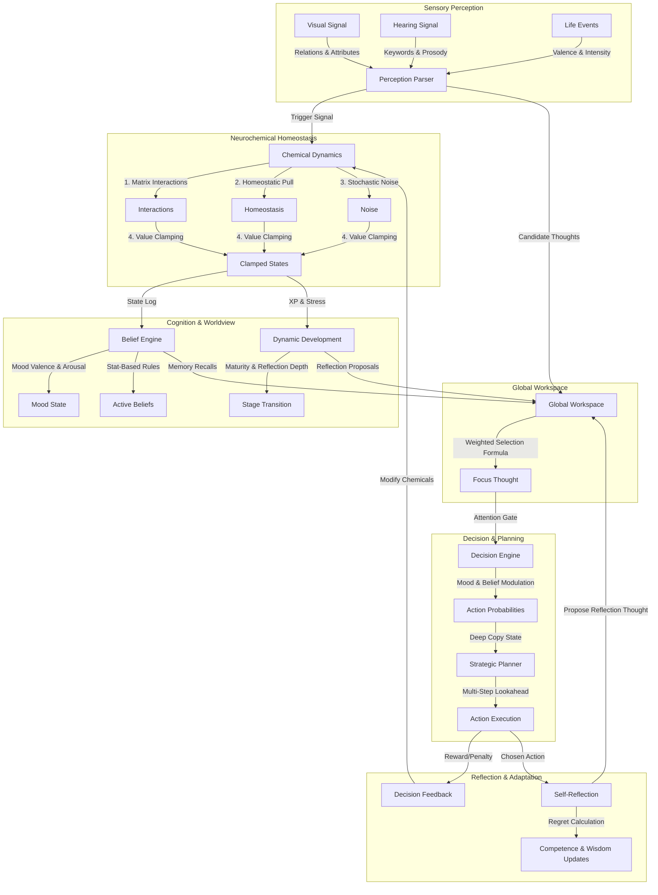

# 🧠 Brain Simulator: Ultimate Technical Interview & Architecture Guide

Welcome to the definitive, deep-dive technical reference for the **Brain Simulator** project. This guide is crafted to help you master the codebase, understand its biological inspirations, and prepare for complex engineering interviews.

Instead of a typical stateless LLM chatbot wrapper, this project is a **developmental cognitive agent prototype** that models stateful, homeostatic, and developmental cognitive loops. It tracks experience, adapts to stress, generalizes emotions, and selects actions based on attention dynamics.

---

## 🗺️ System Architecture & Data Flow

The following diagram illustrates how sensory signals, neurochemical homeostasis, cognitive engines, memory systems, and action loops interact within a single brain cycle (tick):



---

## 1. Implemented Features & Core Workings

Here is a detailed breakdown of what features are implemented in the project and how they work programmatically:

### A. Core Neurochemistry & Homeostasis (`core/brain.py` & `core/interactions.py`)
The agent's internal state is governed by four neurochemicals: **Dopamine**, **Cortisol**, **Oxytocin**, and **Serotonin**. 
- **Interactions**: Every cycle, chemicals influence each other according to a matrix defined in [chemicals.yaml](file:///D:/Brain-Simulator/config/chemicals.yaml) (e.g., Cortisol suppresses Dopamine; Serotonin and Oxytocin buffer Cortisol).
- **Homeostasis**: Values are gradually pulled back to baseline settings. For instance, Serotonin regulates other chemicals, and Oxytocin provides emotional buffering.
- **Clamping & Noise**: Random fluctuations (noise) are added (unless deterministic mode is on), and values are clamped strictly between `[0, 100]`.

### B. Dynamic Identity & Psychological Traits (`core/identity.py`)
Tracks four key psychological traits: **Competence**, **Social Value**, **Resilience**, and **Intelligence**.
- **Evidence-Based Learning**: Trait updates do not happen immediately. The brain collects "evidence" (e.g., success events add competence evidence; criticism adds negative competence evidence). Every tick, the evidence updates the trait values scaled by a `learning_rate` (0.02) and resets.
- **Social Value Decay**: If the agent experiences social neglect or is inactive, social value drifts downwards over time.

### C. Developmental Stage Transitions (`core/development.py`)
Calculates growth and maturity based on experiences.
- **Experience Points (XP)**: Accumulated based on chemical volatility and regret.
- **Stress Slowdown**: Chronic stress (prolonged cortisol spikes) reduces maturity growth. The formula applies a `Stress Slowdown` modifier (scaling down to 0.35) to the maturity assimilation step, modeling developmental psychology.
- **Stage Progression**: Based on maturity and experience, the agent transitions from **Baby** $\rightarrow$ **Child** $\rightarrow$ **Teen** $\rightarrow$ **Adult**. Transitioning triggers an autobiographical milestone and posts a transition thought to the workspace.

### D. Global Workspace Attention (`core/attention.py`)
Implements Bernard Baars' **Global Workspace Theory**.
- **Workspace Competition**: Multiple sources (perceptions, memories, goals, and internal curiosities) post candidate `Thought` objects to the workspace.
- **Selection Formula**: Each candidate's activation score is calculated using:
  $$\text{Activation} = 0.35 \cdot E + 0.20 \cdot N + 0.25 \cdot R + 0.20 \cdot \left(1.0 - \frac{\text{Age}}{30.0}\right)$$
  Where $E$ is Emotional Weight, $N$ is Novelty, $R$ is Relevance to Goals, and Age is the time elapsed since the thought was posted.
- **Focus Streak**: If the same thought wins consecutively, the agent's focus streak increases, contributing to a higher consciousness score.

### E. Rule-Based Belief Engine (`cognition/belief_engine.py`)
Computes statistical schemas and mood states over a sliding window of the last 45 events:
- **Statistical Ratios**: Evaluates ratios of event categories. For instance, if `Criticism Ratio >= 12%`, the belief **"Criticism often follows my attempts"** is activated with a confidence score.
- **Active Belief Modulation**: These active beliefs directly modulate how the agent perceives new events. If the criticism belief is active, incoming praise is appraisal-dampened, and criticism is amplified.
- **Mood States**: Mood is tracked as a vector of Valence and Arousal, generating a mood label: `neutral`, `distressed`, `tense`, `calm`, `confident`, or `hopeful`.

### F. Self-Reflection & Regret-to-Wisdom (`core/self_reflection.py`)
Evaluates the choices made by the Decision Engine.
- **Regret Calculation**: After an action is selected, the brain compares the expected emotional reward of the chosen action to the best possible alternative:
  $$\text{Regret} = \text{Value}(\text{Best Alternative Action}) - \text{Value}(\text{Chosen Action})$$
- **Cognitive Growth**: If regret is positive (indicating a suboptimal decision), the agent's self-appraised `competence` decreases, but its **Wisdom** increases. This models learning from mistakes.
- **Thought Proposal**: A high-regret action triggers a reflection thought, which is posted to the Global Workspace to force cognitive focus on the error.

### G. Decision Engine & Look-Ahead Strategic Planner (`decision/`)
Controls what the agent does in response to its focus.
- **Decision Engine**: Modifies baseline action probabilities (Support, Challenge, Suggest, Refuse, Neutral) using the current neurochemicals, mood state, and active beliefs. For instance, high cortisol and distressed mood amplify the probability of "refuse" and "neutral."
- **Strategic Planner**: Uses recursive tree search (`depth = 2`) by cloning the brain state using `copy.deepcopy` to simulate future ticks. It chooses the action path that yields the highest cumulative expected chemical rewards (dopamine, serotonin, oxytocin) while minimizing cortisol spikes.

---

## 2. Biological Brain vs. Computational Model

To excel in interviews, you must be able to translate code classes into biological equivalents. Use this table as a quick comparison guide:

| Biological Feature | Anatomical / Physiological Basis | Computational Implementation in Code |
| :--- | :--- | :--- |
| **Dopamine** | Midbrain (VTA/SNc). Signals reward prediction error, motivation, reinforcement learning. | Modeled in [chemicals.yaml](file:///D:/Brain-Simulator/config/chemicals.yaml). Drives action "suggest", boosts novelty weight, triggers internal curiosity thoughts. |
| **Cortisol** | Adrenal cortex (HPA axis). Stress response, mobilizes energy, inhibits PFC cognitive control. | Modeled in config. Amplifies "refuse" and "neutral", diminishes "support", lowers resilience, halts developmental progress. |
| **Oxytocin** | Hypothalamus / Pituitary. Social trust, bonding, anxiolytic effect (buffers amygdala). | Modeled in config. Direct negative interaction weight with cortisol; increases probability of "support" actions. |
| **Serotonin** | Brainstem raphe nuclei. Mood stabilization, impulse control, satiety. | Modeled in config. Buffers cortisol fluctuations, scales down risk tolerance, boosts prosocial action weights. |
| **Global Workspace (Attention)** | Frontoparietal network & thalamocortical loops. Broadcasts relevant stimuli to the whole cortex. | [GlobalWorkspace](file:///D:/Brain-Simulator/core/attention.py) class. A competitive queue where thoughts compete via emotional, novelty, goal, and recency weights. |
| **Episodic Memory** | Hippocampus & medial temporal lobe. Stores specific personal experiences. | [AutobiographicalMemory](file:///D:/Brain-Simulator/cognition/autobiographical_memory.py) class. Stores event logs, chemical snapshots, and identity states. Serializes to JSON. |
| **Cognitive Schemas** | Prefrontal & association cortices. Belief frameworks constructed from repeated events. | [BeliefEngine](file:///D:/Brain-Simulator/cognition/belief_engine.py). Computes statistical thresholds over a sliding window of events to activate cognitive rules. |
| **Maturity & Development** | Myelination & synaptic pruning. Prefrontal cortex maturation over a lifecycle. | [DynamicDevelopment](file:///D:/Brain-Simulator/core/development.py) class. Monotonic maturity growth modulated by stress exposure and reflection depth. |
| **Regret & Executive Control** | Orbitofrontal cortex (OFC) & Anterior Cingulate Cortex (ACC). Evaluates counterfactual outcomes. | [SelfReflection](file:///D:/Brain-Simulator/core/self_reflection.py) class. Calculates counterfactual differences between chosen and alternative action rewards. |
| **Speech Regulation** | Broca's area & motor cortex. Chemical modulation of vocal rate/volume (e.g. anxious stuttering). | `regulate_speech` in [brain.py](file:///D:/Brain-Simulator/core/brain.py). Modulates speech rate and intensity based on cortisol/dopamine. |

---

## 3. Advanced Interview Cheat Sheet (Q&A)

Prepare for technical interviews with these highly specific questions and answers designed to demonstrate deep architectural command of the codebase:

### Q1: "How does the agent handle learning and memory generalization?"
> **Answer:** 
> Memory in this project is split into two systems: **Autobiographical Memory** (an episodic logger) and **Appraisal Learning**. 
> When an event is perceived, the `AppraisalEngine` compares the event with historical entries using a `SimilarityEngine`. The similarity engine computes the Euclidean distance between the current state vector (chemicals + identity traits) and past recorded event profiles:
> 
> ```python
> chem_dist = self._vector_distance(chemical_state, profile["chemicals"])
> id_dist = self._vector_distance(identity_state, profile["identity"])
> similarity = chem_sim * 0.4 + id_sim * 0.6
> ```
> 
> If past events are similar above a threshold (0.4), the brain blends their historical chemical outcomes to form a predictive expectation of the current event. The difference between the prediction and the actual outcome represents a **prediction error**, which updates the `AppraisalEngine`'s internal emotional memories via a learning rate (0.06).

---

### Q2: "What is the exact mechanism of developmental maturity in this system, and how does chronic stress affect it?"
> **Answer:** 
> Development is managed in `core/development.py`. The brain accumulates Experience Points (XP) and Reflection Depth. Maturity is a value between `0.0` and `1.0` that builds monotonically. 
> Chronic stress slows down maturity growth. Programmatically, we calculate a `stress_ratio` based on stress events vs. overall experience. This yields a `stress_slowdown` factor:
> 
> ```python
> stress_ratio = min(1.0, self.stress_exposure / max(1.0, self.experience_points))
> stress_slowdown = max(0.35, 1.0 - (0.5 * stress_ratio))
> ```
> 
> This slowdown factor dampens the assimilation step towards target maturity:
> 
> ```python
> assimilation = max(0.0, target_maturity - previous_maturity) * (0.02 * stress_slowdown)
> self.maturity = previous_maturity + assimilation + growth_step
> ```
> 
> A highly stressed agent (high cortisol exposure) can take up to three times longer to transition developmental stages (e.g. Child $\rightarrow$ Teen).

---

### Q3: "How is the Global Workspace Theory (GWT) represented, and how does it drive action selection?"
> **Answer:** 
> GWT is implemented in `core/attention.py`. Candidate thoughts from sensory perceptions, goal processes, internal curiosities, and autobiographical recollections are posted to a static list in `GlobalWorkspace`. 
> During each brain tick, a selection function calculates an activation score for each candidate. The thought with the highest activation wins the workspace competition and becomes the `current_focus`.
> 
> The winning thought is then evaluated by the attention gate in `core/brain.py`. If the winning thought is highly emotional (e.g., its emotional weight exceeds a threshold) or if the agent is under extreme stress, the `DecisionEngine` is invoked to select an action (e.g., support, refuse, neutral, challenge, suggest). If it is not emotional, the system defaults to no action or internal reflection.

---

### Q4: "How does the agent calculate regret, and how does that link to identity and wisdom?"
> **Answer:** 
> Regret calculations are performed by the `SelfReflection` module. After an action is executed, the engine estimates the utility of the chosen action and compares it to the estimated utility of the best alternative action:
> 
> $$\text{Regret} = \text{Utility}(\text{Best Alternative}) - \text{Utility}(\text{Chosen Action})$$
> 
> Where utility is calculated as `Dopamine + Serotonin - Cortisol`. If the chosen action was suboptimal (Regret $> 0$), the agent suffers a blow to its self-esteem, programmatically simulated by adding negative evidence to the `competence` trait:
> 
> ```python
> self.identity.add_evidence("competence", -regret * 0.02)
> ```
> 
> However, this regret is converted into a cognitive asset by increasing the agent's **Wisdom** value:
> 
> ```python
> self.wisdom += regret * self.wisdom_growth_rate
> ```
> This models a core psychological concept: we build wisdom by reflecting on our failures.

---

### Q5: "How does the Strategic Planner perform look-ahead planning without causing side-effects to the active brain state?"
> **Answer:** 
> To evaluate potential futures, the `StrategicPlanner` in `decision/strategic_planner.py` uses `copy.deepcopy(brain)` to duplicate the entire brain state. 
> It then executes hypothetical actions on this cloned state and observes the resulting simulated chemical shifts and feedback rewards over a recursive tree search up to a depth of `2`. Because these updates occur on the deep-copied state, the actual active brain parameters remain completely unaffected by the planning process.

---

### Q6: "What are the decoupled/staged systems in this codebase, and why are they there?"
> **Answer:** 
> Several systems are implemented but not fully wired into the main active tick loop of `core/brain.py`. These represent architectural expansion hooks designed for modular scalability:
> 1. **`bias/bias_engine.py`**: A module that captures conscious state deviations to imprint permanent, slow-drift baseline shifts on neurochemicals (representing slow temperament changes).
> 2. **`development/attachment_system.py`**: Tracks social bonding values with specific caregivers or interaction sources.
> 3. **`development/curiosity_engine.py`**: Tracks the frequency of contexts to calculate a curiosity bonus that feeds into candidate thoughts.
> 4. **`development/goal_system.py`**: Manages the accumulation, decay, and selection of long-term active goals.
> 
> By keeping these systems decoupled, we can test core homeostatic cycles independently and integrate complex behavioral structures as needed.

---

## 4. Key Architectural Insights to Highlight

When presenting this project to interviewers, make sure to highlight these three engineering highlights:

1. **Decoupled Configuration**: All neurochemical baselines, interaction scales, decay rates, and baseline decision weights are externalized in YAML configs (`config/`). The codebase remains generic, allowing developers to change the entire cognitive profile of the agent (e.g., making it highly anxious vs. highly resilient) without editing a single line of Python code.
2. **Deterministic vs. Stochastic Execution**: Setting the `--deterministic` flag replaces random choice weights with greedy maximum selection and removes stochastic noise from chemical homeostasis. This makes cognitive simulation runs 100% reproducible for scientific evaluation.
3. **Structured Perception Ingestion**: Instead of flat text parsing, the perception pipeline is multi-layered. Text is normalized, stopwords are removed, and key concepts are extracted into a dictionary of strengths and associations. Visual input is ingested as semantic spatial relations (e.g., `near`, `on`), which are processed into cognitive events before reaching the core loop.
