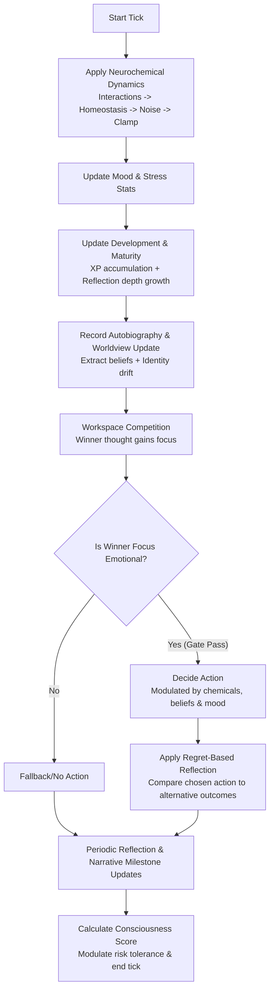

# 🧠 Brain Simulator: Technical Reference & Interview Preparation Guide

Welcome to the **Brain Simulator** technical reference. This document is designed to give you a deep, comprehensive understanding of the project's architecture, underlying logic, implemented features, and technical details. Read this to confidently answer any interviewer's questions about the project's inner workings.

---

## 📌 Project Overview
**Brain Simulator** is a stateful, developmental cognitive agent prototype. Instead of acting as a stateless text chatbot, it simulates a simplified model of human-like cognitive architecture. It accumulates experiences over time, updates an internal chemical homeostasis state, builds an autobiographical memory store, refines a sense of identity (traits like resilience and competence), updates its self-narrative, and uses an attention-based Global Workspace to choose what thoughts to focus on and what actions to execute.

### Key Value Proposition
- **Stateful Cognition**: Tracks experience, maturity, and chemical fluctuations continuously.
- **Biologically Inspired**: Implements chemical dynamics based on neurochemical models (Dopamine, Cortisol, Oxytocin, Serotonin).
- **Perception-Memory Coupling**: Routes multisensory signals (Vision, Hearing, Events) into concept structures and autobiographical logs.
- **Attention-Driven Decisions**: Action selection is governed by the winning thought in a Global Workspace competition, modulated by mood and belief states.

---

## 🛠️ Technology Stack & Libraries Used

### 1. Declared Dependencies (`requirements.txt`)
The project lists several external packages in [requirements.txt](file:///D:/Brain-Simulator/requirements.txt). Here is what they represent and why they are specified:
*   **Core Scientific Computing**: `numpy` and `scipy` for mathematical operations, vector calculations, and statistical scaling.
*   **Computer Vision & Perception**: `opencv-python` (OpenCV) and `Pillow` (PIL) for image processing and structural vision sensors.
*   **Audio & Speech**: `sounddevice`, `soundfile`, and `pyttsx3` for recording ambient sounds, reading audio files, and text-to-speech feedback.
*   **Local AI / LLM Integration**: `ollama` to interface with locally hosted Large Language Models for advanced reasoning or text generation.
*   **Data Analysis & Charting**: `pandas` and `matplotlib` for logging state trajectories, plotting chemical curves, and generating analysis reports.
*   **Testing**: `pytest` and `pytest-cov` for running test suites and checking code coverage.

### 2. Under the Hood: The Standard-Library Core
> [!NOTE]
> **Crucial Interview Insight:** While external libraries like OpenCV, SoundDevice, and Ollama are declared in `requirements.txt` to support external sensory/motor hardware integrations, the **core cognitive engine runs entirely on standard Python libraries**.
>
> This design choice decouples the brain logic from hardware/model interfaces:
> *   `yaml` (via PyYAML) is used to load runtime configurations for chemicals and decisions.
> *   `math` and `random` handle deterministic calculations and stochastic variations.
> *   `collections.deque` manages finite-length queues like recent perceptions and autobiographical memory windows.
> *   `copy.deepcopy` is used by the Strategic Planner to simulate hypothetical futures by duplicating the brain state.
> *   `dataclasses` model structured signals and thoughts cleanly.

---

## 🧱 Project Architecture & Directory Structure

Here is how the modules in the codebase are organized:

```
D:\Brain-Simulator
├── config/              # YAML configs for chemicals, decisions, and engine variables
├── core/                # Core brain loop, attention, consciousness, and homeostasis
├── cognition/           # Belief engine, narrative synthesis, and autobiography
├── learning/            # Appraisal, similarity comparison, and concept extraction
├── memory/              # Associative memory, storage persistence, and pattern prediction
├── decision/            # Action model, decision weights, and look-ahead planning
├── simulation/          # Synthetic environment generation and test scenarios
├── bias/                # Slow-drift baseline shifts (staged for future integration)
├── development/         # Attachment, curiosity, and goal engines (staged extensions)
├── tests/               # Pytest unit tests for workspace competition and brain ticks
└── main.py              # CLI entrypoint supporting 'simulate' and 'live' modes
```

---

## 🔄 The Brain Tick Cycle: Logic Walkthrough

Each simulation step executes a single "tick" of the brain. The logic inside [core/brain.py:tick()](file:///D:/Brain-Simulator/core/brain.py#L248-L396) flows through the following sequential stages:



### Step-by-Step Breakdown

1.  **Chemical Dynamics**: 
    *   **Interactions**: Updates values based on the interaction matrix (e.g., Cortisol suppresses Dopamine; Serotonin and Oxytocin buffer Cortisol).
    *   **Homeostasis**: Gradually pulls chemical values back toward baseline configurations.
    *   **Noise**: Adds stochastic variation (if not in deterministic mode) and clamps values within `[0, 100]`.
2.  **Mood & Resilience**: Updates the agent's mood tone and valence. Chronic high cortisol reduces resilience, whereas a safe environment over time allows recovery (but complacency can cause a minor drop in resilience).
3.  **Developmental Growth**: Reflects based on intelligence level, increasing experience points and updating maturity.
4.  **Autobiography & Worldview**:
    *   Records the cycle step in the autobiography log.
    *   **Belief Extraction**: Scans the recent event log window to identify recurring patterns (e.g., frequent failures build a belief of *"I often fail before I succeed."*).
    *   **Identity Drift**: Applies slow drifts to traits like competence and social value based on active beliefs.
    *   **Narrative Rewrite**: If beliefs change significantly, the agent rewrites its self-narrative.
5.  **Global Workspace Competition**: Gathers candidate thoughts (perceptions, memories, goals, internal curiosities) and computes a winning `Thought` based on **emotional weight (35%), relevance to goals (25%), novelty (20%), and recency (20%)**.
6.  **Decision Gate**:
    *   If the focus thought is highly emotional (crossing a threshold multiple times) or if stress is extremely high, the brain invokes the `DecisionEngine`.
    *   It modifies baseline action probabilities (Support, Challenge, Suggest, Refuse, Neutral) using current chemical states, active beliefs, and mood valence.
7.  **Regret & Wisdom**:
    *   Calculates regret by comparing the emotional value of the chosen action against alternative possibilities.
    *   Regret reduces the agent's self-appraised competence but increases **wisdom**.
8.  **Consciousness Calculation**: Computes a score based on focus stability (streaks), worldview coherence, development, and reflection depth. This score modulates risk tolerance.

---

## 🌟 Implemented Features & Core Algorithms

### 1. Chemistry & Homeostasis
*   **Chemicals**: Dopamine (Reward/Motivation), Cortisol (Stress/Fear), Oxytocin (Social Connection/Safety), and Serotonin (Mood Regulation/Satisfaction).
*   **Homeostasis**: Rather than a simple linear decay, the system implements complex feedback decay. For instance, high social value slows Oxytocin decay, and Serotonin pulls the brain back toward emotional baseline stability.

### 2. Global Workspace Attention
*   Candidates are posted to the workspace.
*   The selection formula is:
    $$\text{Activation} = 0.35 \cdot E + 0.20 \cdot N + 0.25 \cdot R + 0.20 \cdot \left(1.0 - \frac{\text{Age}}{30.0}\right)$$
    *(where $E = \text{Emotional Weight}$, $N = \text{Novelty}$, $R = \text{Relevance to Goals}$)*

### 3. Rule-Based Belief Engine
*   Located in [cognition/belief_engine.py](file:///D:/Brain-Simulator/cognition/belief_engine.py). It analyzes a sliding window of events (default: last 45 events) and computes statistical ratios:
    *   `Criticism Ratio` $\ge 12\% \implies$ **"Criticism often follows my attempts."**
    *   `Failure Ratio` $> 55\% \implies$ **"I often fail before I succeed."**
    *   `Success Ratio` $> 55\% \implies$ **"Persistent effort helps me solve challenges."**
    *   `Rejection Ratio` $> 52\% \implies$ **"Reaching out often leads to rejection."**
    *   `Support Ratio` $> 50\% \implies$ **"Supportive connections are available to me."**
    *   `Threat Ratio` $\ge 10\% \implies$ **"The environment often feels unsafe."**
*   Belief confidence values are updated with a smoothing factor (increased by reflection depth) and decay if their trigger evidence disappears.

### 4. Consciousness Scoring & Risk Regulation
*   Located in [core/consciousness.py](file:///D:/Brain-Simulator/core/consciousness.py). The score is a weighted blend:
    *   **Attention Component (38%)**: Focus stability, streak bonuses, and sensory novelty bonuses.
    *   **Worldview Component (42%)**: Belief coherence, prediction accuracy, and narrative complexity.
    *   **Development Component (12%)**: XP accumulation.
    *   **Reflection Component (8%)**: Reflection depth.
*   **Risk Modulation**: If consciousness is low ($< 0.4$), the brain increases risk tolerance (impulsive behavior). If consciousness is high ($> 0.6$), risk tolerance drops (calculated, cautious behavior).

### 5. Multi-Modality Perception Pipelines
The brain provides direct programmatic APIs to absorb external sensory signals:
*   `brain.perceive(event)`: Handles structured life events with valence and intensity.
*   `brain.receive_visual_signal(signal)`: Accepts inputs containing lists of visible objects, attributes, and relationships. It translates these into semantic event tags like `face_recognized` or `threat_detected` before injecting them into the brain loop.
*   `brain.receive_hearing_signal(signal)`: Accepts transcript sentences and speaker identifiers, performing keyword-based sentiment classification.

### 6. Attention-Driven Decision Engine
*   If the attention gate passes, `DecisionEngine` applies modifiers to action categories:
    *   **High Cortisol**: Boosts *refuse* and *neutral*, while reducing *support*.
    *   **High Dopamine/Competence**: Boosts *suggest*.
    *   **Positive Mood Valence**: Promotes *support* and *suggest* (prosocial behaviors).
    *   **Active Beliefs**: Direct impact. For instance, having a high confidence in the belief *"Reaching out often leads to rejection"* penalizes the probability of selecting a *support* action.

### 7. Strategic Planner (Hypothetical Look-Ahead)
*   Located in [decision/strategic_planner.py](file:///D:/Brain-Simulator/decision/strategic_planner.py).
*   **Mechanism**: Uses `copy.deepcopy` to replicate the brain state. It recursively simulates future step ticks (up to `max_depth = 2`) to evaluate the expected rewards (chemical feedback) of potential choices, allowing the agent to perform multi-step planning.

---

## 💡 Advanced Interview Insights (The "Aha!" Details)

If an interviewer asks what makes this project unique, or wants to test how deeply you know the codebase, discuss these aspects:

### 1. Staged and Decoupled Code Modules
There are several files in the repository that are fully written and syntactically correct, but are **not currently wired into the core brain loop**. These represent architectural hooks ready for future scaling:
*   [bias/bias_engine.py](file:///D:/Brain-Simulator/bias/bias_engine.py): Slow-drift chemical baseline modifier.
*   [development/attachment_system.py](file:///D:/Brain-Simulator/development/attachment_system.py): Tracks interpersonal bonding levels with caregiver/teacher sources.
*   [development/curiosity_engine.py](file:///D:/Brain-Simulator/development/curiosity_engine.py): Tracks novelty frequency to output curiosity scores.
*   [development/goal_system.py](file:///D:/Brain-Simulator/development/goal_system.py): Accumulates and decays long-term goals.
*   [learning/abstraction_engine.py](file:///D:/Brain-Simulator/learning/abstraction_engine.py): Groups contexts into category profiles.
*   [learning/chemical_optimizer.py](file:///D:/Brain-Simulator/learning/chemical_optimizer.py): Calculates reward prediction error history trends.
*   *Why mention this?* It demonstrates a modular engineering mindset—designing extensible interfaces and system hooks before implementing full end-to-end integration.

### 2. Regret-to-Wisdom Mechanics
Instead of just succeeding or failing, the agent calculates **regret**:
$$\text{Regret} = \text{Value}(\text{Best Alternative Action}) - \text{Value}(\text{Chosen Action})$$
If regret is positive, it signifies the agent made a suboptimal choice. This directly decreases its `competence` trait evidence (representing a blow to self-esteem) but increases its `wisdom` value. This models a realistic psychological trade-off: we learn more from mistakes than successes.

### 3. Chronically Stressed Development
In [core/development.py](file:///D:/Brain-Simulator/core/development.py), maturity growth is calculated as:
$$\text{Assimilation} = (\text{Target Maturity} - \text{Previous Maturity}) \cdot (0.02 \cdot \text{Stress Slowdown})$$
Here, `Stress Slowdown` is derived from the ratio of stress exposure to overall experience points. This means a high-stress lifestyle (persistent cortisol spikes) slows down developmental rate and inhibits stage transitions (e.g., baby $\to$ child $\to$ teen $\to$ adult), mirroring developmental psychology.

---

## 🚀 How to Run and Demo the Code

Be ready to explain how to run the CLI to a potential interviewer:

*   **Simulation Mode** (Runs structured caregiver events like praise/criticism automatically):
    ```bash
    python main.py --mode simulate --cycles 100
    ```
*   **Deterministic Simulation** (Disables random fluctuations for reproducible research runs):
    ```bash
    python main.py --mode simulate --cycles 100 --deterministic
    ```
*   **Live Debug Mode** (Interactive CLI loop where typing forces a tick and dumps the complete brain state variables):
    ```bash
    python main.py --mode live
    ```
