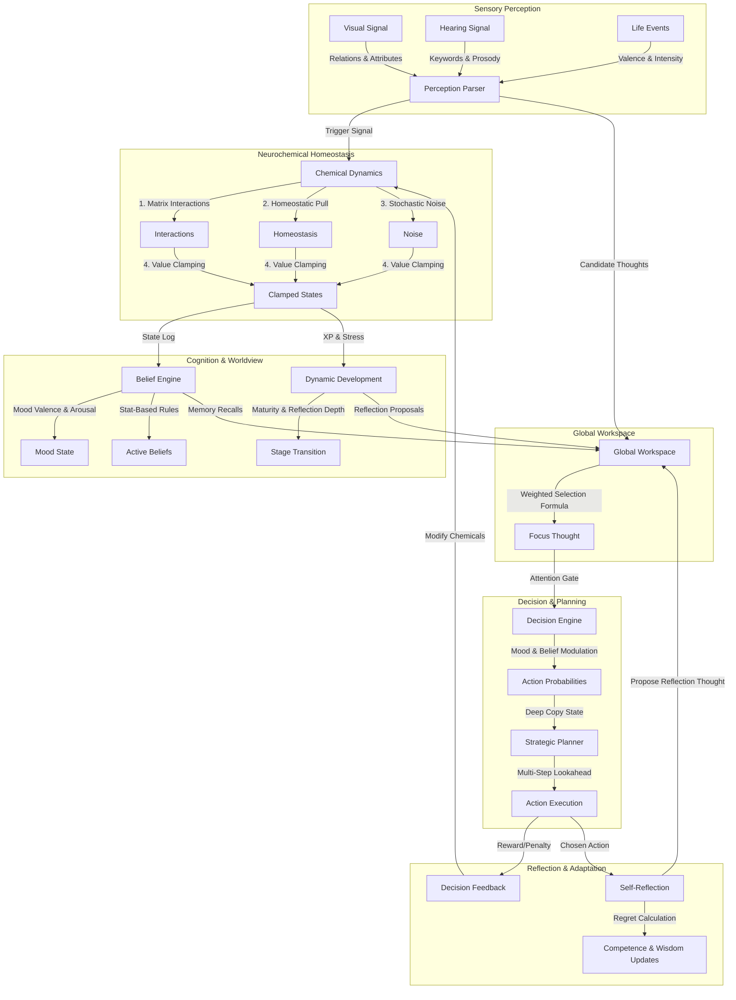

# 🧠 Brain Simulator: Ultimate Technical Interview & Architecture Guide

Welcome to the definitive, deep-dive technical reference for the **Brain Simulator** project. This guide is crafted to help you master the codebase, understand its biological inspirations, and prepare for complex engineering interviews.

Instead of a typical stateless LLM chatbot wrapper, this project is a **developmental cognitive agent prototype** that models stateful, homeostatic, and developmental cognitive loops. It tracks experience, adapts to stress, generalizes emotions, and selects actions based on attention dynamics.

---

## 🗺️ System Architecture & Data Flow

The following diagram illustrates how sensory signals, neurochemical homeostasis, cognitive engines, memory systems, and action loops interact within a single brain cycle (tick):



---

## 1. Implemented Features & Core Workings

Here is a detailed breakdown of what features are implemented in the project and how they work programmatically:

### A. Core Neurochemistry & Homeostasis (`core/brain.py`, `chemicals/` & `core/interactions.py`)
The agent's internal state is governed by five neurochemicals: **Dopamine**, **Cortisol**, **Oxytocin**, **Serotonin**, and **Norepinephrine**.
* **Chemical Objects & Registry**: The chemicals are represented as **[Chemical](file:///D:/Brain-Simulator/chemicals/models.py#L3)** and **[ChemicalRegistry](file:///D:/Brain-Simulator/chemicals/registry.py#L4)** objects, implementing a dict-like interface for backward compatibility.
* **Interactions**: Every cycle, chemicals influence each other according to a matrix defined in [chemicals.yaml](file:///D:/Brain-Simulator/config/chemicals.yaml) (e.g., Cortisol suppresses Dopamine; Serotonin and Oxytocin buffer Cortisol).
* **Norepinephrine Dynamics**: Modulates global arousal and sensory gating. It decays toward its baseline, spikes on perceived scene novelty, and rises in response to cortisol increases.
* **Homeostasis**: Values are gradually pulled back to baseline settings. For instance, Serotonin regulates other chemicals, and Oxytocin provides emotional buffering.
* **Clamping & Noise**: Random fluctuations (noise) are added (unless deterministic mode is on), and values are clamped strictly between `[0, 100]`.

### B. Dynamic Identity & Psychological Traits (`core/identity.py`)
Tracks four key psychological traits: **Competence**, **Social Value**, **Resilience**, and **Intelligence**.
- **Evidence-Based Learning**: Trait updates do not happen immediately. The brain collects "evidence" (e.g., success events add competence evidence; criticism adds negative competence evidence). Every tick, the evidence updates the trait values scaled by a `learning_rate` (0.02) and resets.
- **Social Value Decay**: If the agent experiences social neglect or is inactive, social value drifts downwards over time.

### C. Developmental Stage Transitions (`core/development.py`)
Calculates growth and maturity based on experiences.
- **Experience Points (XP)**: Accumulated based on chemical volatility and regret.
- **Stress Slowdown**: Chronic stress (prolonged cortisol spikes) reduces maturity growth. The formula applies a `Stress Slowdown` modifier (scaling down to 0.35) to the maturity assimilation step, modeling developmental psychology.
- **Stage Progression**: Based on maturity and experience, the agent transitions from **Baby** $\rightarrow$ **Child** $\rightarrow$ **Teen** $\rightarrow$ **Adult**. Transitioning triggers an autobiographical milestone and posts a transition thought to the workspace.

### D. Global Workspace Attention (`core/attention.py`)
Implements Bernard Baars' **Global Workspace Theory**.
- **Workspace Competition**: Multiple sources (perceptions, memories, goals, and internal curiosities) post candidate `Thought` objects to the workspace.
- **Selection Formula**: Each candidate's activation score is calculated using:
  $$\text{Activation} = 0.35 \cdot E + 0.20 \cdot N + 0.25 \cdot R + 0.20 \cdot \left(1.0 - \frac{\text{Age}}{30.0}\right)$$
  Where $E$ is Emotional Weight, $N$ is Novelty, $R$ is Relevance to Goals, and Age is the time elapsed since the thought was posted.
- **Concurrent Workspace Instances**: Workspaces are now instantiable and thread-safe to support concurrent simulations. Property and method descriptors (`WorkspaceProperty`, `WorkspaceMethod`) route requests to the instance or fallback to a default singleton.
- **Norepinephrine Gating**: If Norepinephrine is high (hyper-arousal), focus stability drops (hyper-arousal penalty) and distraction events randomly decay the focus streak.

### E. Rule-Based Belief Engine (`cognition/belief_engine.py`)
Computes statistical schemas and mood states over a sliding window of the last 45 events:
- **Statistical Ratios**: Evaluates ratios of event categories. For instance, if `Criticism Ratio >= 12%`, the belief **"Criticism often follows my attempts"** is activated with a confidence score.
- **Active Belief Modulation**: These active beliefs directly modulate how the agent perceives new events. If the criticism belief is active, incoming praise is appraisal-dampened, and criticism is amplified.
- **Mood States**: Mood is tracked as a vector of Valence and Arousal, generating a mood label: `neutral`, `distressed`, `tense`, `calm`, `confident`, or `hopeful`.

### F. Self-Reflection & Regret-to-Wisdom (`core/self_reflection.py`)
Evaluates the choices made by the Decision Engine.
- **Regret Calculation**: After an action is selected, the brain compares the expected emotional reward of the chosen action to the best possible alternative:
  $$\text{Regret} = \text{Value}(\text{Best Alternative Action}) - \text{Value}(\text{Chosen Action})$$
- **Cognitive Growth**: If regret is positive (indicating a suboptimal decision), the agent's self-appraised `competence` decreases, but its **Wisdom** increases. This models learning from mistakes.
- **Thought Proposal**: A high-regret action triggers a reflection thought, which is posted to the Global Workspace to force cognitive focus on the error.

### G. Decision Engine & Look-Ahead Strategic Planner (`decision/`)
Controls what the agent does in response to its focus.
- **Decision Engine**: Modifies baseline action probabilities using neurochemicals, mood state, active beliefs, and striatal RL Q-values.
- **Striatal RL Loop**: Maps the 6 discrete mood states to action $Q$-values. The influence of Q-values is gated by a Norepinephrine temperature parameter (high NE drives exploration, low NE drives exploitation). Updates are performed via Reward Prediction Errors (RPE), triggering phasic dopamine bursts or dips.
- **Strategic Planner**: Uses recursive tree search (`depth = 2`) to project state transitions mathematically on lightweight state dictionaries, completely avoiding `copy.deepcopy` bottlenecks.

### H. Hippocampal Replay & Mind-Wandering (`core/internal_thoughts.py`)
- **Associative Memory Replay**: Spontaneous thought generation computes the cosine similarity between the current neurochemical/identity state vector and the snapshots of past autobiographical memory events.
- **Replay Gating**: If similarity exceeds `0.78`, the matching past event is replayed in the workspace, carrying its original emotional weight; otherwise, it falls back to a standard curiosity template.

---

## 2. Biological Brain vs. Computational Model

To excel in interviews, you must be able to translate code classes into biological equivalents. Use this table as a quick comparison guide:

| Biological Feature | Anatomical / Physiological Basis | Computational Implementation in Code |
| :--- | :--- | :--- |
| **Dopamine** | Midbrain (VTA/SNc). Signals reward prediction error, motivation, reinforcement learning. | Modeled in [chemicals.yaml](file:///D:/Brain-Simulator/config/chemicals.yaml). Phasic updates based on Reward Prediction Errors (RPE) update striatal Q-values. Drives internal thought generation and action suggestions. |
| **Cortisol** | Adrenal cortex (HPA axis). Stress response, mobilizes energy, inhibits PFC cognitive control. | Modeled in config. Amplifies "refuse" and "neutral", diminishes "support", lowers resilience, halts developmental progress. |
| **Oxytocin** | Hypothalamus / Pituitary. Social trust, bonding, anxiolytic effect (buffers amygdala). | Modeled in config. Direct negative interaction weight with cortisol; increases probability of "support" actions. |
| **Serotonin** | Brainstem raphe nuclei. Mood stabilization, impulse control, satiety. | Modeled in config. Buffers cortisol fluctuations, scales down risk tolerance, boosts prosocial action weights. |
| **Norepinephrine** | Locus Coeruleus (pons/brainstem). Modulates sensory signal-to-noise ratio, hyper-arousal, and exploration vs exploitation. | Spikes on novelty and cortisol rises. Gates decision exploration temperature and penalizes attention focus stability in the workspace. |
| **Global Workspace (Attention)** | Frontoparietal network & thalamocortical loops. Broadcasts relevant stimuli to the whole cortex. | [GlobalWorkspace](file:///D:/Brain-Simulator/core/attention.py) class. A competitive queue where thoughts compete via emotional, novelty, goal, and recency weights. |
| **Episodic Memory** | Hippocampus & medial temporal lobe. Stores specific personal experiences. | [AutobiographicalMemory](file:///D:/Brain-Simulator/cognition/autobiographical_memory.py) class. Stores event logs, chemical snapshots, and identity states. Serializes to JSON. |
| **Cognitive Schemas** | Prefrontal & association cortices. Belief frameworks constructed from repeated events. | [BeliefEngine](file:///D:/Brain-Simulator/cognition/belief_engine.py). Computes statistical thresholds over a sliding window of events to activate cognitive rules. |
| **Maturity & Development** | Myelination & synaptic pruning. Prefrontal cortex maturation over a lifecycle. | [DynamicDevelopment](file:///D:/Brain-Simulator/core/development.py) class. Monotonic maturity growth modulated by stress exposure and reflection depth. |
| **Regret & Executive Control** | Orbitofrontal cortex (OFC) & Anterior Cingulate Cortex (ACC). Evaluates counterfactual outcomes. | [SelfReflection](file:///D:/Brain-Simulator/core/self_reflection.py) class. Calculates counterfactual differences between chosen and alternative action rewards. |
| **Speech Regulation** | Broca's area & motor cortex. Chemical modulation of vocal rate/volume (e.g. anxious stuttering). | `regulate_speech` in [brain.py](file:///D:/Brain-Simulator/core/brain.py). Modulates speech rate and intensity based on cortisol/dopamine. |

---

## 3. Advanced Interview Cheat Sheet (Q&A)

Prepare for technical interviews with these highly specific questions and answers designed to demonstrate deep architectural command of the codebase:

### Q1: "How does the agent handle learning and memory generalization?"
> **Answer:** 
> Memory in this project is split into two systems: **Autobiographical Memory** (an episodic logger) and **Appraisal Learning**. 
> When an event is perceived, the `AppraisalEngine` compares the event with historical entries using a `SimilarityEngine`. The similarity engine computes the Euclidean distance between the current state vector (chemicals + identity traits) and past recorded event profiles:
> 
> ```python
> chem_dist = self._vector_distance(chemical_state, profile["chemicals"])
> id_dist = self._vector_distance(identity_state, profile["identity"])
> similarity = chem_sim * 0.4 + id_sim * 0.6
> ```
> 
> If past events are similar above a threshold (0.4), the brain blends their historical chemical outcomes to form a predictive expectation of the current event. The difference between the prediction and the actual outcome represents a **prediction error**, which updates the `AppraisalEngine`'s internal emotional memories via a learning rate (0.06).

---

### Q2: "What is the exact mechanism of developmental maturity in this system, and how does chronic stress affect it?"
> **Answer:** 
> Development is managed in `core/development.py`. The brain accumulates Experience Points (XP) and Reflection Depth. Maturity is a value between `0.0` and `1.0` that builds monotonically. 
> Chronic stress slows down maturity growth. Programmatically, we calculate a `stress_ratio` based on stress events vs. overall experience. This yields a `stress_slowdown` factor:
> 
> ```python
> stress_ratio = min(1.0, self.stress_exposure / max(1.0, self.experience_points))
> stress_slowdown = max(0.35, 1.0 - (0.5 * stress_ratio))
> ```
> 
> This slowdown factor dampens the assimilation step towards target maturity:
> 
> ```python
> assimilation = max(0.0, target_maturity - previous_maturity) * (0.02 * stress_slowdown)
> self.maturity = previous_maturity + assimilation + growth_step
> ```
> 
> A highly stressed agent (high cortisol exposure) can take up to three times longer to transition developmental stages (e.g. Child $\rightarrow$ Teen).

---

### Q3: "How is the Global Workspace Theory (GWT) represented, and how does it drive action selection?"
> **Answer:** 
> GWT is implemented in `core/attention.py`. Candidate thoughts from sensory perceptions, goal processes, internal curiosities, and autobiographical recollections are posted to a static list in `GlobalWorkspace`. 
> During each brain tick, a selection function calculates an activation score for each candidate. The thought with the highest activation wins the workspace competition and becomes the `current_focus`.
> 
> The winning thought is then evaluated by the attention gate in `core/brain.py`. If the winning thought is highly emotional (e.g., its emotional weight exceeds a threshold) or if the agent is under extreme stress, the `DecisionEngine` is invoked to select an action (e.g., support, refuse, neutral, challenge, suggest). If it is not emotional, the system defaults to no action or internal reflection.

---

### Q4: "How does the agent calculate regret, and how does that link to identity and wisdom?"
> **Answer:** 
> Regret calculations are performed by the `SelfReflection` module. After an action is executed, the engine estimates the utility of the chosen action and compares it to the estimated utility of the best alternative action:
> 
> $$\text{Regret} = \text{Utility}(\text{Best Alternative}) - \text{Utility}(\text{Chosen Action})$$
> 
> Where utility is calculated as `Dopamine + Serotonin - Cortisol`. If the chosen action was suboptimal (Regret $> 0$), the agent suffers a blow to its self-esteem, programmatically simulated by adding negative evidence to the `competence` trait:
> 
> ```python
> self.identity.add_evidence("competence", -regret * 0.02)
> ```
> 
> However, this regret is converted into a cognitive asset by increasing the agent's **Wisdom** value:
> 
> ```python
> self.wisdom += regret * self.wisdom_growth_rate
> ```
> This models a core psychological concept: we build wisdom by reflecting on our failures.

---

### Q5: "How does the Strategic Planner perform look-ahead planning without causing side-effects to the active brain state?"
> **Answer:** 
> The `StrategicPlanner` in `decision/strategic_planner.py` uses mathematical transitions projected onto lightweight state dictionaries (containing chemical values, active baseline configurations, and identity snapshots).
> It simulates the outcomes of actions over a tree search up to a depth of `2` entirely on these decoupled dictionaries, completely avoiding CPU-intensive `copy.deepcopy(brain)` operations. This isolation ensures the planning loops leave the active brain instance parameters completely untouched.

---

### Q6: "What are the decoupled/staged systems in this codebase, and why are they there?"
> **Answer:** 
> Background evolutionary drives and social modeling systems are kept decoupled from the active tick loop to keep homeostatic cycles simple and testable:
> 1. **`development/attachment_system.py`**: Tracks social bonding values with caregivers or social interaction sources.
> 2. **`development/curiosity_engine.py`**: Tracks context encounter frequency to calculate curiosity bonuses for preconscious thoughts.
> 3. **`development/goal_system.py`**: Manages the accumulation, decay, and selection of active goals.
> 
> *Note: The `BiasEngine` was previously decoupled, but has since been fully integrated into the perception appraisal and homeostatic baseline loops.*

---

## 4. Key Architectural Insights to Highlight

When presenting this project to interviewers, make sure to highlight these three engineering highlights:

1. **Decoupled Configuration**: All neurochemical baselines, interaction scales, decay rates, and baseline decision weights are externalized in YAML configs (`config/`). The codebase remains generic, allowing developers to change the entire cognitive profile of the agent (e.g., making it highly anxious vs. highly resilient) without editing a single line of Python code.
2. **Deterministic vs. Stochastic Execution**: Setting the `--deterministic` flag replaces random choice weights with greedy maximum selection and removes stochastic noise from chemical homeostasis. This makes cognitive simulation runs 100% reproducible for scientific evaluation.
3. **Structured Perception Ingestion**: Instead of flat text parsing, the perception pipeline is multi-layered. Text is normalized, stopwords are removed, and key concepts are extracted into a dictionary of strengths and associations. Visual input is ingested as semantic spatial relations (e.g., `near`, `on`), which are processed into cognitive events before reaching the core loop.

---

## 5. Exhaustive Mathematical & Algorithmic Specifications

For advanced technical reviews, this section details the precise mathematical formulas, threshold values, and conditional logics present throughout the Virtual Brain codebase.

### A. Neurochemical Equations & Saturation Modeling
Chemical fluctuations are computed step-by-step to prevent linear runaways, mimicking biological receptor saturation.

1. **Receptor Saturation Scaling (`_saturation_scaled_delta`)**:
   When a decision or event applies a feedback delta to a chemical, the actual change is scaled based on how close the chemical's current value is to its boundary:
   $$\text{Headroom} = \begin{cases} 
      \frac{\text{Max} - \text{Value}}{\text{Max} - \text{Min}} & \text{if } \Delta \ge 0 \\ 
      \frac{\text{Value} - \text{Min}}{\text{Max} - \text{Min}} & \text{if } \Delta < 0 
   \end{cases}$$
   $$\text{Scale} = \max(0.15, \min(1.0, \text{Headroom} \times 1.8))$$
   $$\Delta_{\text{actual}} = \Delta \times \text{Scale}$$
   This ensures that as a neurochemical approaches 100 or 0, it becomes progressively harder to push it further, establishing a soft asymptotic limit.

2. **Homeostasis Integration Cycle**:
   For each chemical, the homeostatic pull is computed as:
   $$\text{Delta}_{\text{base}} = (\text{Baseline} - \text{Value}) \times 0.04$$
   $$\text{Delta}_{\text{clamped}} = \max(-1.0, \min(1.0, \text{Delta}_{\text{base}}))$$
   
   *Special Chemical Rules:*
   *   **Dopamine**: If there are no positive valence perceptions in the current cycle, upward pulls are capped at `0.5` instead of `1.0`.
   *   **Oxytocin**: Decay is modulated by the agent's identity `social_value`:
       $$\text{Decay Multiplier} = \begin{cases} 
          0.4 & \text{if } \text{social\_value} > 0.8 \\ 
          0.7 & \text{if } \text{social\_value} > 0.6 \\ 
          1.0 & \text{otherwise} 
       \end{cases}$$
       If Oxytocin drops below 62.0, an extra positive correction pull is applied: $\text{Oxytocin} \leftarrow \text{Oxytocin} + (62.0 - \text{Oxytocin}) \times 0.04$.
   *   **Cortisol**: Excess cortisol above `45.0` experiences a rapid passive clearance pull:
       $$\text{Cortisol Decay} = 0.04 \times (\text{Cortisol} - 45.0)$$
       $$\text{Delta}_{\text{final}} = \text{Delta}_{\text{clamped}} - \text{Cortisol Decay}$$
   *   **Serotonin**: Exerts a stabilizing regulation pull on itself post-update:
       $$\text{Serotonin} \leftarrow \text{Serotonin} + (60.0 - \text{Serotonin}) \times 0.02$$

3. **Stochastic Noise Insertion**:
   If not running in `--deterministic` mode, a random value is injected into each chemical:
   $$\text{Value} \leftarrow \text{Value} + \text{Uniform}(-\text{noise\_limit}, \text{noise\_limit})$$
   *(e.g., limit is 0.5 for dopamine, 0.4 for cortisol/serotonin, 0.3 for oxytocin)*.

---

### B. Workspace Selection Algorithm
Thoughts compete in a Global Workspace using an activation score evaluated at runtime:

1. **Recency Decay Factor**:
   The age of a thought (time elapsed in seconds since it was posted to the workspace) decays its recency factor linearly:
   $$\text{Recency Factor} = \max\left(0.0, 1.0 - \frac{\text{Age}}{30.0}\right)$$

2. **Weighted Activation Formula**:
   $$\text{Activation} = 0.35 \cdot E + 0.20 \cdot N + 0.25 \cdot R + 0.20 \cdot \text{Recency Factor}$$
   *   $E$: Emotional Weight (0.0 to 1.0)
   *   $N$: Novelty (0.0 to 1.0)
   *   $R$: Relevance to Goals (0.0 to 1.0)

3. **Focus Stability Component**:
   The focus stability score determines attention consistency, contributing to the consciousness score:
   $$\text{Focus Stability} = \min\left(1.0, \frac{\text{Streak}}{20}\right)$$
   If the winning thought is a consecutive repeat, `Streak` increments by 1. If it changes, `Streak` resets to 1.

---

### C. Belief Engine Schema Rules
The `BeliefEngine` processes the last 45 events in its sliding window to compute statistical ratios. If a ratio matches the criteria below, the belief is active:

*   **Criticism Schema**: Activated if `criticism_like_count >= 3` and $\frac{\text{criticism\_like\_count}}{\text{total\_events}} \ge 0.12$.
    $$\text{Confidence}_{\text{target}} = 0.2 + (\text{criticism\_ratio} \times 1.9) + \min\left(0.2, \frac{\text{criticism\_count}}{25.0}\right)$$
*   **Failure Schema**: Activated if `task_total >= 4` and $\frac{\text{failures}}{\text{task\_total}} > 0.55$.
    $$\text{Confidence}_{\text{target}} = 0.25 + (\text{failure\_ratio} - 0.5) \times 1.3$$
*   **Mastery/Effort Schema**: Activated if `task_total >= 4` and $\frac{\text{successes}}{\text{task\_total}} > 0.55$.
    $$\text{Confidence}_{\text{target}} = 0.25 + (\text{success\_ratio} - 0.5) \times 1.3$$
*   **Rejection Schema**: Activated if `social_attempts >= 4` and $\frac{\text{rejections}}{\text{social\_attempts}} > 0.52$.
    $$\text{Confidence}_{\text{target}} = 0.2 + (\text{rejection\_ratio} \times 0.9)$$
*   **Support Schema**: Activated if `social_attempts >= 4` and $\frac{\text{supports}}{\text{social\_attempts}} > 0.5$.
    $$\text{Confidence}_{\text{target}} = 0.2 + (\text{support\_ratio} \times 0.8)$$
*   **Threat Schema**: Activated if `threat_load >= 3` and $\frac{\text{threat\_load}}{\text{total\_events}} \ge 0.1$.
    $$\text{Confidence}_{\text{target}} = 0.2 + (\text{threat\_ratio} \times 1.6)$$
*   **Adaptation Schema**: Activated if `novelty_exposure >= 3` and $\text{successes} \ge \max(1, 0.7 \times \text{failures})$.
    $$\text{Confidence}_{\text{target}} = 0.2 + \min\left(0.55, \frac{\text{novelty\_exposure}}{\text{total\_events}}\right)$$

**Confidence Smoothing Update:**
Active belief confidences are smoothed across ticks:
$$\text{Smooth Rate} = \text{smoothing\_factor} \times \left(1.0 + \min\left(0.3, \frac{\text{reflection\_depth}}{25.0}\right)\right)$$
$$\text{Confidence}_{\text{new}} = \text{Confidence}_{\text{old}} + (\text{Confidence}_{\text{target}} - \text{Confidence}_{\text{old}}) \times \text{Smooth Rate}$$
If a belief is no longer triggered by recent evidence, it decays: $\text{Confidence} \leftarrow \text{Confidence} \times 0.985$, and is deleted if it falls below `0.08`.

---

### D. Action Probability Modulation Matrix
The baseline probabilities for actions in `DecisionEngine` are modified by internal variables before normalization:

| Action Category | Baseline Prob | Neurochemical Modifiers | Mood & Identity Modifiers | Belief Modifiers |
| :--- | :--- | :--- | :--- | :--- |
| **support** | 0.35 | $+0.85 \cdot \text{Oxy} - 0.5 \cdot \text{Cort}$<br>$+0.16 \cdot \text{Sero}$ | $+0.35 \cdot \text{Salience} \cdot \max(0, \text{MoodValence})$<br>$+0.28 \cdot \text{SocialNorm}$ | $-0.22 \cdot \text{RejectionBelief}$<br>$+0.24 \cdot \text{SupportBelief}$ |
| **challenge** | 0.25 | $+0.35 \cdot \text{Cort}$ | $+0.35 \cdot \text{Salience} \cdot \max(0, -\text{MoodValence})$ | $+0.10 \cdot \text{MasteryBelief}$ |
| **suggest** | 0.20 | $+0.55 \cdot \text{Dop} - 0.25 \cdot \text{Cort}$<br>$+0.14 \cdot \text{Dop}$ | $+0.22 \cdot \text{Competence}$ | $+0.16 \cdot \text{MasteryBelief}$ |
| **refuse** | 0.10 | $+0.90 \cdot \text{Cort}$ | $+0.4 \cdot \text{Cort} \cdot (1 - \text{SocialNorm})$<br>$+0.22 \cdot \max(0, -\text{MoodValence})$ | $-0.10 \cdot \text{SupportBelief}$<br>$+0.12 \cdot \text{UnsafeBelief}$ |
| **neutral** | 0.10 | $+0.55 \cdot \text{Cort}$ | $+0.3 \cdot \text{Cort} + 0.1 \cdot (1 - \text{Salience})$ | $+0.12 \cdot \text{RejectionBelief}$<br>$+0.18 \cdot \text{UnsafeBelief}$ |

*   **Stress Gating**: If stress level (cortisol / 100) exceeds `0.6`, refuse probability is increased by $+0.55 \cdot \text{Pressure}$, neutral is increased by $+0.35 \cdot \text{Pressure}$, and support is decreased by $-0.25 \cdot \text{Pressure}$ (where $\text{Pressure} = \frac{\text{stress} - 0.6}{0.4}$).
*   **Mood Shifts**: A negative mood valence ($<-0.2$) boosts refuse by $+1.0 \times \text{Push}$ and neutral by $+0.75 \times \text{Push}$, while suppressing support by $-0.45 \times \text{Push}$ (where $\text{Push} = |\text{Valence}| \times (0.2 + 0.1 \times \text{Arousal})$).

---

### E. Speech Regulation Logic (`regulate_speech`)
When generating or reacting with linguistic outputs, the brain regulates speech parameters:
1.  **Stress/Fatigue Gating**: If `fatigue > 0.7` or `cortisol > 70`, the speech is split at the first period (`.`) and truncated to a single sentence, representing an inability to maintain long chains of thought.
2.  **Childhood Gating**: If the developmental stage is "child", the string is restricted to the first `28` tokens to model limited vocabulary/expression.
3.  **Coordination Correction**: Any trailing conjunctions (`and`, `or`, `but`, `so`, `because`) at the end of truncated strings are dynamically pruned.
4.  **Empathy Prefixing**: If `oxytocin > 70` and the output does not begin with personal pronouns (e.g., `i `, `we `, `let`, `you`), the system prepends `"I hear you. "` to the statement, signaling high social alignment.

---

### F. Staged/Decoupled Subsystems
These modules represent syntactically complete extensions ready for future scaling:

1.  **`BiasEngine` (`bias/bias_engine.py`)**:
    *   **Imprinting**: Conscious chemical values are compared to baselines. If deviation $|\text{Conscious} - \text{Baseline}| \ge 8.0$, a slow imprint alters personality baseline values:
        $$\text{Bias} \leftarrow \text{Bias} + \text{Sign}(\text{Deviation}) \times 0.0005$$
    *   **Baseline Shift**: The active baseline of any chemical is shifted temporarily:
        $$\text{Baseline}_{\text{active}} = \text{Baseline}_{\text{config}} + \text{Bias} \times \text{Weight}$$
    *   **Reaction Scaling**: Amplifies incoming emotional impacts:
        $$\Delta_{\text{scaled}} = \Delta \times (1 + \text{Bias} \times \text{Weight})$$

2.  **`AttachmentSystem` (`development/attachment_system.py`)**:
    *   Tracks bonding values with caregiver/social sources between `[-1.0, 1.0]`:
        $$\text{Attachment} \leftarrow \text{Attachment} + 0.01 \cdot \text{Reward} - 0.01 \cdot \text{Stress}$$
    *   Bonding decays slowly: $\text{Attachment} \leftarrow \text{Attachment} \times (1 - 0.0003)$ per tick.

3.  **`CuriosityEngine` (`development/curiosity_engine.py`)**:
    *   Tracks how often specific context keys are encountered.
    *   Calculates a curiosity bonus to boost candidate thoughts based on inverse frequency:
        $$\text{Curiosity Bonus} = \frac{1}{1 + \text{Frequency}}$$

4.  **`GoalSystem` (`development/goal_system.py`)**:
    *   Goal reward values are accumulated in a dictionary:
        $$\text{Goal Value} \leftarrow \text{Goal Value} + \text{Reward} \times 0.05$$
    *   Goal values decay slowly: $\text{Goal} \leftarrow \text{Goal} \times 0.999$ per cycle. The goal with the highest reward value is returned as the active target.

---

## 6. Conscious vs. Subconscious Brain Dynamics (Biological Alignment)

In human cognitive psychology and neurobiology, mental processes are divided into conscious awareness and subconscious/preconscious engines. The **Brain Simulator** implements this division, modeling how background physiological and statistical shifts influence and shape the active "mind."

Here is a detailed breakdown of how **Conscious** and **Subconscious** dynamics are simulated and interact within this codebase:

```
┌────────────────────────────────────────────────────────────────────────┐
│                      CONSCIOUS BRAIN (Awareness)                        │
│                                                                        │
│  ┌───────────────────────┐  ┌─────────────────────┐  ┌──────────────┐  │
│  │   Global Workspace    │  │   Self-Narrative    │  │  Reflection  │  │
│  │  (Attention Focus)    │  │(Internal Monologue) │  │(Metacognition│  │
│  └───────────▲───────────┘  └──────────▲──────────┘  └──────▲───────┘  │
└──────────────┼─────────────────────────┼────────────────────┼──────────┘
               │ Broadcasts Winner       │ Shapes Narrative   │ Evaluates Outcomes
               │                         │                    │
┌──────────────┼─────────────────────────┼────────────────────┼──────────┐
│                    SUBCONSCIOUS BRAIN (Background)                     │
│                                                                        │
│  ┌───────────────────────┐  ┌─────────────────────┐  ┌──────────────┐  │
│  │  Homeostatic Engines  │  │   Belief Engine     │  │ Preconscious │  │
│  │ (Neurochemical Drift) │  │ (Cognitive Schemas) │  │  Candidates  │  │
│  └───────────────────────┘  └─────────────────────┘  └──────────────┘  │
│  ┌───────────────────────┐  ┌─────────────────────┐  ┌──────────────┐  │
│  │   Appraisal Engine    │  │  Decoupled Drives   │  │ Bias/Temper  │  │
│  │(Background Similarity)│  │ (Curiosity, Goals)  │  │  (Baselines) │  │
│  └───────────────────────┘  └─────────────────────┘  └──────────────┘  │
└────────────────────────────────────────────────────────────────────────┘
```

### A. The Conscious Brain (Explicit Awareness)
Conscious processes are those that directly enter the agent's focal awareness, are verbally/linguistically structured, or represent deliberate cognitive control:

1. **Attention Focus / Global Workspace (`core/attention.py`)**:
   * *Biological Equivalent*: The frontoparietal attention network and the central executive.
   * *How it works in Code*: Multiple thoughts (perceptions, memories, goals) contend in the `GlobalWorkspace`. The winner of the workspace competition becomes the `current_focus` (active conscious focus). The agent is only "aware" of one focus thought per cycle.

2. **The Self-Narrative (`cognition/narrative_engine.py`)**:
   * *Biological Equivalent*: The default mode network (DMN) and the left-hemisphere interpreter, which constructs a continuous verbal story to explain our behaviors and states.
   * *How it works in Code*: The `NarrativeEngine` computes a text string (`current_narrative`) based on recent event success ratios and stress levels (e.g. *"I struggle but I endure. The world feels stressful"*). This simulates the verbal internal monologue of the conscious mind.

3. **Metacognitive Self-Reflection (`core/self_reflection.py`)**:
   * *Biological Equivalent*: Prefrontal cortex reflection and error-monitoring (Anterior Cingulate Cortex).
   * *How it works in Code*: The `SelfReflection` module runs after an action is selected, comparing expectations with counterfactual alternatives. It calculates regret and consciously posts a reflection thought (`"Reflection on support: regret=0.15"`) back to the workspace so the agent is forced to pay attention to its own performance.

4. **Consciousness Scoring (`core/consciousness.py`)**:
   * *Biological Equivalent*: Thalamocortical coherence, vigilance, and focus stability.
   * *How it works in Code*: Computes a score based on focus stability (streaks), worldview coherence, narrative complexity, and development. This score directly modulates conscious risk tolerance—high consciousness prompts deliberate, risk-averse behavior, whereas low consciousness shifts the agent into impulsive reactivity.

---

### B. The Subconscious Brain (Background Processing)
Subconscious and preconscious processes run silently under the hood, updating physical/chemical parameters and pre-filtering information before it ever reaches conscious focus:

1. **Preconscious Candidate Pool (`core/attention.py`)**:
   * *Biological Equivalent*: The vast array of sensory, memory, and cognitive signals competing in the thalamus before being gated into conscious attention.
   * *How it works in Code*: The `_candidates` list in `GlobalWorkspace` holds all thoughts currently posted. These thoughts exist in a preconscious buffer; unless a candidate thought wins the activation formula, it remains subconscious and is eventually cleared at the end of the tick.

2. **Neurochemical Homeostasis & Drift (`core/brain.py` & `core/interactions.py`)**:
   * *Biological Equivalent*: The autonomic nervous system and deep brain stem nuclei (e.g., raphe nuclei, VTA) regulating baseline arousal, heart rate, and baseline moods.
   * *How it works in Code*: In every tick, chemical baseline decay, matrix interactions, and stochastic noise adjustments run automatically. The agent cannot consciously modify its Dopamine or Cortisol levels; these levels drift subconsciously and pre-set the agent's mood tone and baseline action probabilities.

3. **Cognitive Schemas & Active Beliefs (`cognition/belief_engine.py`)**:
   * *Biological Equivalent*: Cognitive biases, mental models, and deep schemas stored in association cortices that automatically shape how we interpret events.
   * *How it works in Code*: The `BeliefEngine` constantly calculates criticism, failure, and support ratios over a sliding window of past events. It activates schemas silently (e.g. *"Criticism often follows my attempts"*). These active schemas then warp appraisal calculations under the hood (e.g., scaling down dopamine feedback from positive events).

4. **Automatic Emotional Appraisal (`learning/appraisal_engine.py` & `learning/similarity_engine.py`)**:
   * *Biological Equivalent*: The amygdala and limbic system executing fast, automatic, non-conscious emotional evaluations of sensory stimuli before visual/auditory signals reach the cortex.
   * *How it works in Code*: The `SimilarityEngine` scans past profiles by calculating vector distances under the hood to find similar past occurrences. It generalizes predictions and applies updates to the `AppraisalEngine` without any conscious intervention.

5. **Decoupled Background Drives (`development/`)**:
   * *Biological Equivalent*: Core evolutionary drives (curiosity, goal-seeking, social attachment) that run automatically to ensure survival.
   * *How it works in Code*: The `AttachmentSystem`, `CuriosityEngine`, and `GoalSystem` run background counters (e.g., tracking context frequencies, calculating bonding decay ratios). These systems silently feed curiosity bonuses and relevance factors into thoughts, guiding what the conscious mind chooses to focus on.


